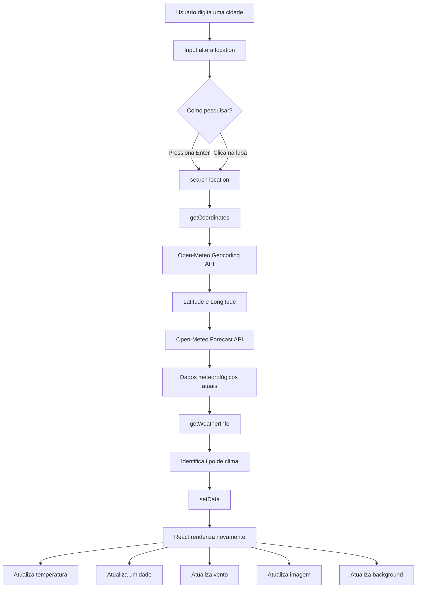

# 🌤️ Live Weather App
 
Aplicação web desenvolvida em **React** para consultar as condições meteorológicas atuais de uma cidade utilizando a API pública da **Open-Meteo**.
 
O projeto permite pesquisar uma cidade, descobrir automaticamente suas coordenadas geográficas e, a partir delas, consultar informações como:
 
* temperatura atual;
* umidade relativa;
* velocidade do vento;
* condição meteorológica;
* data local;
* imagem correspondente ao clima;
* alteração dinâmica das cores da interface.
 
O projeto foi desenvolvido utilizando **React + Vite** e não possui backend, banco de dados ou sistema de autenticação.
 
---
 
# 📚 Objetivo do projeto
 
O principal objetivo do projeto é praticar conceitos fundamentais do desenvolvimento de aplicações React, incluindo:
 
* JSX;
* componentes;
* `useState`;
* eventos;
* inputs controlados;
* renderização condicional;
* `async/await`;
* Fetch API;
* consumo de APIs REST;
* manipulação de dados JSON;
* atualização da interface baseada em estado;
* organização básica de componentes;
* separação de funções utilitárias;
* estilização com CSS.
 
---
 
# 🖥️ Funcionamento geral
 
O fluxo da aplicação ocorre em duas etapas principais.
 
Quando o usuário informa uma cidade, a aplicação primeiro precisa descobrir suas coordenadas geográficas.
 
Por exemplo:
 
```text
São Paulo
↓
Latitude: -23.55
Longitude: -46.63
```
 
Depois disso, latitude e longitude são utilizadas para consultar as condições meteorológicas atuais.
 
```text
Cidade
  ↓
Geocoding API
  ↓
Latitude + Longitude
  ↓
Forecast API
  ↓
Dados meteorológicos
  ↓
React State
  ↓
Interface atualizada
```
 
---
 
# 🔄 Fluxo da aplicação
 

 
---
 
# 🧱 Arquitetura atual
 
O projeto utiliza uma arquitetura simples baseada em componentes React.
 
Atualmente a maior parte da lógica da aplicação está concentrada no componente:
 
```text
WheatherApp.jsx
```
 
Esse componente é responsável por:
 
* controlar o estado;
* capturar eventos;
* realizar chamadas HTTP;
* processar dados;
* determinar o clima;
* selecionar imagens;
* selecionar backgrounds;
* formatar datas;
* renderizar a interface.
 
A arquitetura atual pode ser representada desta forma:
 
```text
main.jsx
   │
   ▼
App.jsx
   │
   ▼
WheatherApp.jsx
   │
   ├── Open-Meteo Geocoding API
   │
   ├── Open-Meteo Forecast API
   │
   ├── weatherCode.js
   │
   ├── imagens
   │
   └── WheatherApp.css
```
 
É uma arquitetura adequada para uma aplicação pequena e principalmente para fins didáticos.
 
Conforme o projeto crescer, a lógica de API poderá ser extraída para serviços e custom hooks.
 
---
 
# 📁 Estrutura do projeto
 
```text
LiveWheaterApp-dev/
│
├── public/
│   ├── favicon.svg
│   └── icons.svg
│
├── src/
│   │
│   ├── assets/
│   │   └── images/
│   │       ├── cloudy.png
│   │       ├── loading.gif
│   │       ├── rainy.png
│   │       ├── snowy.png
│   │       └── sunny.png
│   │
│   ├── components/
│   │   ├── WheatherApp.jsx
│   │   └── WheatherApp.css
│   │
│   ├── utils/
│   │   └── weatherCode.js
│   │
│   ├── App.jsx
│   ├── index.css
│   └── main.jsx
│
├── .gitignore
├── .oxlintrc.json
├── index.html
├── package.json
├── package-lock.json
├── vite.config.js
└── README.md
```
 
---
 
# 📂 Responsabilidade dos arquivos
 
| Arquivo                          | Responsabilidade                                    |
| -------------------------------- | --------------------------------------------------- |
| `src/main.jsx`                   | Inicializa a aplicação React                        |
| `src/App.jsx`                    | Componente raiz da aplicação                        |
| `src/components/WheatherApp.jsx` | Implementa interface, estados e integração com APIs |
| `src/components/WheatherApp.css` | Estilização principal do Weather App                |
| `src/utils/weatherCode.js`       | Traduz códigos meteorológicos em condições visuais  |
| `src/index.css`                  | Configura estilos globais                           |
| `src/assets/images/`             | Armazena imagens das condições meteorológicas       |
| `index.html`                     | Documento HTML utilizado pelo Vite                  |
| `vite.config.js`                 | Configuração do Vite                                |
| `package.json`                   | Dependências e scripts do projeto                   |
| `.oxlintrc.json`                 | Configuração do Oxlint                              |
 
---
 
# ⚛️ Inicialização do React
 
O arquivo:
 
```text
src/main.jsx
```
 
é o ponto de entrada da aplicação.
 
Ele utiliza:
 
```jsx
createRoot(document.getElementById('root'))
```
 
para montar a aplicação React dentro do elemento:
 
```html
<div id="root"></div>
```
 
existente no `index.html`.
 
A aplicação também está envolvida por:
 
```jsx
<StrictMode>
```
 
que ajuda a identificar determinados problemas durante o desenvolvimento.
 
O fluxo inicial é:
 
```text
index.html
   ↓
main.jsx
   ↓
App.jsx
   ↓
WheatherApp.jsx
```
 
---
 
# 🧩 Componente App
 
O `App.jsx` funciona atualmente como um componente de composição.
 
Sua principal responsabilidade é renderizar:
 
```jsx
<WheatherApp />
```
 
Portanto:
 
```text
App
└── WheatherApp
```
 
Nesta versão o `App` ainda possui pouca responsabilidade, mas ele poderá futuramente controlar:
 
* rotas;
* layouts;
* providers;
* temas;
* novos componentes;
* páginas adicionais.
 
---
 
# 🌤️ Componente WheatherApp
 
O componente:
 
```text
src/components/WheatherApp.jsx
```
 
é o componente central da aplicação.
 
Ele controla praticamente todo o comportamento do Weather App.
 
---
 
# 🧠 Estados da aplicação
 
A aplicação possui dois estados principais.
 
## `data`
 
```jsx
const [data, setData] = useState(null)
```
 
Responsável por armazenar os dados meteorológicos.
 
Antes de uma consulta:
 
```text
data = null
```
 
Depois de uma consulta, o objeto possui aproximadamente esta estrutura:
 
```javascript
{
  time: "...",
  temperature_2m: 24.7,
  relative_humidity_2m: 65,
  wind_speed_10m: 8.4,
  weather_code: 2,
 
  city: "São Paulo",
  country: "Brasil",
 
  weatherType: "cloudy",
  weatherDescription: "Partly cloudy"
}
```
 
---
 
## `location`
 
```jsx
const [location, setLocation] = useState("")
```
 
Armazena o conteúdo digitado no campo de pesquisa.
 
Por exemplo:
 
```text
location = "São Paulo"
```
 
Esse estado transforma o campo de pesquisa em um **input controlado pelo React**.
 
---
 
# ⌨️ Input controlado
 
O campo possui:
 
```jsx
value={location}
```
 
e:
 
```jsx
onChange={handleInputChanges}
```
 
Quando o usuário digita alguma coisa, é executado:
 
```jsx
const handleInputChanges = (e) => {
  setLocation(e.target.value)
}
```
 
Assim:
 
```text
Usuário digita
     ↓
onChange
     ↓
handleInputChanges
     ↓
setLocation
     ↓
React atualiza location
```
 
---
 
# 🔎 Executando uma pesquisa
 
Existem duas formas de iniciar uma pesquisa.
 
## Pressionando Enter
 
O componente utiliza:
 
```jsx
onKeyDown={handleKeyDown}
```
 
e verifica:
 
```jsx
if (e.key === 'Enter') {
  search(location)
}
```
 
---
 
## Clicando na lupa
 
A lupa executa:
 
```jsx
onClick={() => search(location)}
```
 
Nos dois casos, a função principal executada é:
 
```javascript
search(location)
```
 
---
 
# 🌎 Etapa 1 — Geocodificação
 
Uma API meteorológica normalmente trabalha com:
 
```text
latitude
longitude
```
 
e não diretamente com nomes de cidades.
 
Por isso, antes de buscar o clima, o projeto executa:
 
```javascript
getCoordinates(cityName)
```
 
A aplicação consulta o endpoint:
 
```text
https://geocoding-api.open-meteo.com/v1/search
```
 
utilizando parâmetros como:
 
```text
name
count
language
format
```
 
A URL gerada possui aproximadamente este formato:
 
```text
https://geocoding-api.open-meteo.com/v1/search?name=São%20Paulo&count=1&language=pt&format=json
```
 
A função utiliza:
 
```javascript
encodeURIComponent(cityName)
```
 
para garantir que caracteres especiais e espaços sejam corretamente enviados pela URL.
 
---
 
# 📍 Dados retornados pela geocodificação
 
A aplicação utiliza:
 
```javascript
{
  latitude,
  longitude,
  name,
  country
}
```
 
Exemplo conceitual:
 
```javascript
{
  latitude: -23.55,
  longitude: -46.63,
  name: "São Paulo",
  country: "Brasil"
}
```
 
Esses dados são retornados para a função `search()`.
 
---
 
# 🌡️ Etapa 2 — Consulta meteorológica
 
Depois de obter latitude e longitude, a aplicação consulta:
 
```text
https://api.open-meteo.com/v1/forecast
```
 
A consulta solicita especificamente:
 
```text
temperature_2m
relative_humidity_2m
wind_speed_10m
weather_code
```
 
A URL é construída dinamicamente:
 
```javascript
const url = `
  https://api.open-meteo.com/v1/forecast
  ?latitude=${latitude}
  &longitude=${longitude}
  &current=temperature_2m,relative_humidity_2m,wind_speed_10m,weather_code
  &timezone=auto
`.replace(/\s/g, '')
```
 
O `.replace(/\s/g, '')` remove os espaços utilizados apenas para melhorar a leitura do código.
 
---
 
# 📊 Dados meteorológicos utilizados
 
A resposta da API contém um objeto:
 
```javascript
current
```
 
A aplicação utiliza:
 
| Campo                  | Significado                      |
| ---------------------- | -------------------------------- |
| `temperature_2m`       | Temperatura atual                |
| `relative_humidity_2m` | Umidade relativa                 |
| `wind_speed_10m`       | Velocidade do vento              |
| `weather_code`         | Código da condição meteorológica |
| `time`                 | Data/hora da medição             |
 
---
 
# 🌦️ Interpretação do Weather Code
 
A Open-Meteo retorna a condição meteorológica através de um código numérico.
 
Exemplo:
 
```text
0
1
2
3
45
61
80
95
```
 
O projeto não exibe diretamente esse número.
 
O arquivo:
 
```text
src/utils/weatherCode.js
```
 
é responsável por transformar o código em uma informação compreensível para a interface.
 
Exemplo:
 
```javascript
0: {
  type: 'sunny',
  description: 'Clear sky'
}
```
 
ou:
 
```javascript
61: {
  type: 'rainy',
  description: 'Slight rain'
}
```
 
---
 
# ☀️ Categorias visuais
 
Os diferentes códigos foram agrupados em quatro categorias principais:
 
```text
sunny
cloudy
rainy
snowy
```
 
Essas categorias determinam:
 
* imagem exibida;
* descrição;
* background da aplicação.
 
---
 
# 🗺️ Mapeamento simplificado
 
```text
Weather Code
      │
      ▼
getWeatherInfo()
      │
      ├── sunny
      ├── cloudy
      ├── rainy
      └── snowy
```
 
Caso um código não exista no mapeamento, a função retorna:
 
```javascript
{
  type: 'cloudy',
  description: 'Unknown weather'
}
```
 
Isso funciona como um fallback da aplicação.
 
---
 
# 🖼️ Imagens meteorológicas
 
As imagens estão armazenadas em:
 
```text
src/assets/images/
```
 
Existem imagens para:
 
```text
sunny.png
cloudy.png
rainy.png
snowy.png
```
 
O componente cria um objeto:
 
```javascript
const weatherImages = {
  sunny,
  cloudy,
  rainy,
  snowy
}
```
 
Posteriormente utiliza:
 
```javascript
weatherImages[data.weatherType]
```
 
para escolher dinamicamente a imagem correta.
 
---
 
# 🎨 Background dinâmico
 
Além das imagens, as cores da interface também mudam de acordo com o clima.
 
O projeto possui:
 
```javascript
const backgroundImages = {
  sunny: 'linear-gradient(...)',
  cloudy: 'linear-gradient(...)',
  rainy: 'linear-gradient(...)',
  snowy: 'linear-gradient(...)'
}
```
 
Quando os dados meteorológicos são atualizados:
 
```javascript
backgroundImages[data.weatherType]
```
 
determina o background utilizado.
 
Assim, existe o fluxo:
 
```text
weather_code
    ↓
getWeatherInfo()
    ↓
weatherType
    ↓
backgroundImages
    ↓
novo gradiente
```
 
---
 
# 📅 Formatação da data
 
A função:
 
```javascript
formatDate()
```
 
utiliza:
 
```javascript
Intl.DateTimeFormat
```
 
com configuração:
 
```javascript
{
  weekday: 'short',
  day: '2-digit',
  month: 'short'
}
```
 
e localização:
 
```text
pt-BR
```
 
Dessa forma a data recebida da API é convertida para um formato mais amigável.
 
---
 
# 💾 Atualização do estado
 
Depois que todas as informações são obtidas, a aplicação executa:
 
```javascript
setData({
  ...weatherData.current,
  city: coordinates.name,
  country: coordinates.country,
  weatherType: weatherInfo.type,
  weatherDescription: weatherInfo.description
})
```
 
Aqui o operador:
 
```javascript
...
```
 
copia os dados existentes em:
 
```javascript
weatherData.current
```
 
e adiciona informações extras.
 
---
 
# 🔁 Reatividade do React
 
Quando:
 
```javascript
setData()
```
 
é executado, o React renderiza novamente o componente.
 
A interface passa automaticamente a utilizar os novos valores.
 
Exemplo:
 
```jsx
{data
  ? `${data.relative_humidity_2m}%`
  : '35%'
}
```
 
Isso significa:
 
```text
Se data existir
    ↓
mostrar dado da API
 
Caso contrário
    ↓
mostrar valor inicial
```
 
---
 
# 🏠 Estado inicial da aplicação
 
Antes que uma pesquisa seja realizada, a interface apresenta alguns dados demonstrativos.
 
Entre eles:
 
```text
London
Clear
Sat, 15 Ago
35%
3 km/h
```
 
Esses valores são placeholders visuais.
 
É importante observar que **nenhuma consulta automática para London é realizada quando a aplicação inicia**.
 
Ou seja:
 
```text
London exibido inicialmente
≠
dados carregados da API
```
 
Depois da primeira pesquisa, os valores passam a vir da API.
 
---
 
# 🛠️ Tecnologias utilizadas
 
## Front-end
 
* React
* React DOM
* JavaScript
* JSX
* CSS
 
## Build tool
 
* Vite
 
## Qualidade de código
 
* Oxlint
 
## APIs
 
* Open-Meteo Geocoding API
* Open-Meteo Forecast API
 
## Recursos externos
 
* Font Awesome
* Google Fonts
 
---
 
# 📦 Principais dependências
 
O `package.json` declara:
 
```json
{
  "dependencies": {
    "react": "^19.2.8",
    "react-dom": "^19.2.8"
  }
}
```
 
Dependências de desenvolvimento:
 
```json
{
  "devDependencies": {
    "@types/react": "^19.2.17",
    "@types/react-dom": "^19.2.3",
    "@vitejs/plugin-react": "^6.0.4",
    "oxlint": "^1.75.0",
    "vite": "^8.2.0"
  }
}
```
 
---
 
# ✅ Pré-requisitos
 
Antes de executar o projeto é necessário possuir:
 
* Node.js;
* npm;
* navegador moderno;
* conexão com a internet.
 
Como o projeto utiliza **Vite 8**, utilize:
 
```text
Node.js 20.19+
```
 
ou:
 
```text
Node.js 22.12+
```
 
Para novos ambientes, utilizar uma versão atual do **Node.js 22 LTS** é uma opção simples.
 
Verifique as versões instaladas:
 
```bash
node --version
npm --version
```
 
---
 
# 🚀 Como executar
 
## 1. Entre na pasta do projeto
 
```bash
cd LiveWheaterApp-dev
```
 
---
 
## 2. Instale as dependências
 
```bash
npm install
```
 
Como o projeto possui `package-lock.json`, também pode ser utilizado:
 
```bash
npm ci
```
 
O `npm ci` é especialmente útil em ambientes de CI ou quando se deseja instalar exatamente as versões registradas no lock file.
 
---
 
## 3. Inicie o servidor de desenvolvimento
 
```bash
npm run dev
```
 
O Vite normalmente disponibilizará a aplicação em:
 
```text
http://localhost:5173
```
 
O terminal informará a URL correta.
 
Caso a porta `5173` esteja ocupada, o Vite poderá utilizar outra porta.
 
---
 
# 🧪 Como utilizar
 
Depois que a aplicação estiver aberta:
 
1. clique no campo de pesquisa;
2. digite o nome de uma cidade;
3. pressione `Enter`;
 
ou:
 
1. digite a cidade;
2. clique no ícone da lupa.
 
Exemplo:
 
```text
São Paulo
```
 
Outros exemplos:
 
```text
London
Tokyo
Buenos Aires
Lima
Santiago
Montevideo
Bogotá
New York
```
 
A aplicação irá:
 
```text
buscar cidade
    ↓
obter coordenadas
    ↓
buscar clima
    ↓
interpretar weather code
    ↓
atualizar interface
```
 
---
 
# 🏗️ Gerando build de produção
 
Para gerar uma versão otimizada:
 
```bash
npm run build
```
 
O Vite criará:
 
```text
dist/
```
 
Essa pasta contém os arquivos finais que podem ser publicados em um servidor web.
 
---
 
# 👀 Testando a build de produção
 
Depois do build:
 
```bash
npm run preview
```
 
O Vite iniciará um servidor local utilizando os arquivos presentes em:
 
```text
dist/
```
 
---
 
# 🔍 Executando o lint
 
O projeto utiliza Oxlint.
 
Execute:
 
```bash
npm run lint
```
 
O comando executado pelo projeto é:
 
```bash
oxlint
```
 
---
 
# 📜 Scripts disponíveis
 
| Comando           | Descrição                              |
| ----------------- | -------------------------------------- |
| `npm run dev`     | Inicia o servidor de desenvolvimento   |
| `npm run build`   | Gera a build de produção               |
| `npm run preview` | Executa localmente a build de produção |
| `npm run lint`    | Analisa o código utilizando Oxlint     |
 
---
 
# 🔐 Variáveis de ambiente
 
Atualmente o projeto não utiliza:
 
```text
.env
```
 
nem API Keys.
 
As URLs utilizadas pelo projeto estão diretamente definidas no componente.
 
Exemplo:
 
```javascript
https://geocoding-api.open-meteo.com/v1/search
```
 
e:
 
```javascript
https://api.open-meteo.com/v1/forecast
```
 
Para o escopo atual isso simplifica bastante o projeto.
 
Em uma evolução da arquitetura, as URLs base poderiam ser movidas para arquivos de configuração.
 
---
 
# 🌐 Arquitetura de comunicação
 
A aplicação não possui backend próprio.
 
O navegador realiza as requisições diretamente para a Open-Meteo.
 
```text
┌───────────────────┐
│      Usuário      │
└─────────┬─────────┘
          │
          ▼
┌───────────────────┐
│   React Frontend  │
└─────────┬─────────┘
          │
          ├───────────────► Geocoding API
          │
          │                     │
          │                     ▼
          │              Latitude/Longitude
          │
          └───────────────► Forecast API
                                │
                                ▼
                          Weather Data
```
 
Portanto o projeto não possui:
 
* Node.js backend;
* Express;
* FastAPI;
* banco de dados;
* autenticação;
* persistência local;
* API própria.
 
Node.js é utilizado apenas como ambiente de desenvolvimento/build do front-end.
 
---
 
# 🎨 Estilização
 
A estilização principal está localizada em:
 
```text
src/components/WheatherApp.css
```
 
O projeto utiliza:
 
* Flexbox;
* gradientes;
* posicionamento absoluto;
* sombras;
* `border-radius`;
* tipografia customizada;
* unidades `rem`.
 
No CSS global:
 
```text
src/index.css
```
 
é configurado:
 
```css
html {
    font-size: 62.5%;
}
```
 
Com isso:
 
```text
1rem ≈ 10px
```
 
facilitando a leitura das medidas.
 
Por exemplo:
 
```css
font-size: 1.6rem;
```
 
representa aproximadamente:
 
```text
16px
```
 
---
 
# 🔤 Fontes e ícones
 
A aplicação utiliza a fonte:
 
```text
Lilita One
```
 
carregada através do Google Fonts.
 
Os ícones são carregados através do Font Awesome.
 
São utilizados ícones para:
 
* localização;
* pesquisa;
* umidade;
* vento.
 
Como esses recursos são externos, é necessário acesso à internet para carregá-los.
 
---
 
# ⚠️ Tratamento de erros atual
 
A função principal utiliza:
 
```javascript
try {
   ...
} catch (error) {
   console.error(error.message)
}
```
 
Quando uma cidade não é encontrada:
 
```javascript
throw new Error('Cidade não encontrada')
```
 
Porém o erro atualmente aparece apenas no console do navegador.
 
O usuário não recebe uma mensagem visual.
 
Exemplo atual:
 
```text
Cidade inválida
      ↓
Error
      ↓
console.error()
```
 
Uma evolução recomendada seria:
 
```text
Cidade inválida
      ↓
Error
      ↓
setError()
      ↓
Mensagem apresentada na interface
```
 
---
 
# ⚠️ Pontos identificados no projeto atual
 
Durante a análise do projeto foram encontrados alguns pontos que podem ser melhorados.
 
## 1. Nome `Wheather`
 
Diversos arquivos utilizam:
 
```text
Wheather
```
 
A grafia correta em inglês é:
 
```text
Weather
```
 
Exemplos atuais:
 
```text
WheatherApp.jsx
WheatherApp.css
LiveWheaterApp
```
 
Uma futura refatoração poderia utilizar:
 
```text
WeatherApp.jsx
WeatherApp.css
LiveWeatherApp
```
 
---
 
## 2. Import não utilizado em App.jsx
 
Existe:
 
```javascript
import { useState } from 'react'
```
 
em:
 
```text
App.jsx
```
 
mas `useState` não é utilizado nesse componente.
 
O import pode ser removido.
 
---
 
## 3. Loading preparado, mas não implementado
 
O projeto possui:
 
```text
src/assets/images/loading.gif
```
 
e também estilos:
 
```css
.loader
```
 
Porém nenhum estado de loading está implementado atualmente.
 
Uma futura versão poderia possuir:
 
```javascript
const [loading, setLoading] = useState(false)
```
 
---
 
## 4. CSS de erro preparado, mas não utilizado
 
O CSS possui:
 
```css
.not-found
```
 
porém essa classe ainda não é utilizada pelo componente.
 
Isso indica que provavelmente existe intenção de apresentar visualmente:
 
```text
City not found
```
 
ou mensagem semelhante.
 
---
 
## 5. Não existe validação para pesquisa vazia
 
Atualmente é possível executar:
 
```javascript
search("")
```
 
Uma validação poderia impedir isso:
 
```javascript
if (!cityName.trim()) {
  return
}
```
 
---
 
## 6. Respostas HTTP não são validadas
 
O código executa:
 
```javascript
const response = await fetch(url)
const data = await response.json()
```
 
Porém não verifica:
 
```javascript
response.ok
```
 
Uma implementação mais robusta seria:
 
```javascript
if (!response.ok) {
  throw new Error('Erro ao acessar API')
}
```
 
---
 
## 7. API e interface estão acopladas
 
Atualmente funções como:
 
```text
getCoordinates()
search()
```
 
estão dentro do componente visual.
 
Para um projeto pequeno isso é aceitável.
 
Conforme a aplicação crescer, seria interessante separar:
 
```text
components
services
hooks
utils
```
 
---
 
## 8. País é armazenado, mas não exibido
 
O estado recebe:
 
```javascript
country: coordinates.country
```
 
porém esse dado ainda não aparece na interface.
 
Poderia ser apresentado como:
 
```text
São Paulo, Brasil
```
 
---
 
## 9. Dados iniciais são hardcoded
 
Antes da primeira pesquisa aparecem:
 
```text
London
Clear
35%
3 km/h
Sat, 15 Ago
```
 
Esses dados não vieram da API.
 
Uma opção seria carregar automaticamente uma cidade inicial utilizando `useEffect`.
 
---
 
## 10. Não existem testes automatizados
 
Não foram encontrados testes unitários, de integração ou de componentes.
 
Uma futura evolução poderia utilizar:
 
```text
Vitest
React Testing Library
```
 
---
 
## 11. Responsividade limitada
 
O card possui dimensões fixas:
 
```css
width: 35rem;
height: 65rem;
```
 
e não existem media queries.
 
Em dispositivos pequenos isso pode causar problemas de visualização.
 
---
 
## 12. Acessibilidade do botão de busca
 
Atualmente o clique acontece diretamente em:
 
```jsx
<i
  className="fa-solid fa-magnifying-glass"
  onClick={...}
></i>
```
 
Semanticamente seria melhor utilizar:
 
```jsx
<button>
  <i className="fa-solid fa-magnifying-glass"></i>
</button>
```
 
Isso melhora:
 
* navegação por teclado;
* acessibilidade;
* semântica HTML;
* leitores de tela.
 
---
 
## 13. Idiomas estão misturados
 
A aplicação possui textos em inglês:
 
```text
Enter Location
Humidity
Wind
Clear
```
 
mas utiliza:
 
```javascript
language=pt
```
 
na geocodificação e:
 
```javascript
pt-BR
```
 
na formatação da data.
 
Uma evolução pode padronizar a interface completamente em português ou implementar internacionalização.
 
---
 
# 🏗️ Sugestão de evolução da arquitetura
 
Conforme o projeto crescer, uma estrutura interessante seria:
 
```text
src/
│
├── assets/
│   └── images/
│
├── components/
│   ├── SearchBar/
│   │   ├── SearchBar.jsx
│   │   └── SearchBar.module.css
│   │
│   ├── WeatherCard/
│   │   ├── WeatherCard.jsx
│   │   └── WeatherCard.module.css
│   │
│   └── WeatherMetrics/
│       └── WeatherMetrics.jsx
│
├── hooks/
│   └── useWeather.js
│
├── services/
│   └── openMeteoService.js
│
├── utils/
│   ├── weatherCode.js
│   └── formatDate.js
│
├── App.jsx
├── main.jsx
└── index.css
```
 
---
 
# 🔌 Camada de serviços sugerida
 
A comunicação com APIs poderia sair do componente e ficar em:
 
```text
services/openMeteoService.js
```
 
Responsabilidades:
 
```text
OpenMeteoService
│
├── getCoordinates(city)
└── getCurrentWeather(latitude, longitude)
```
 
Assim o componente React ficaria responsável principalmente por:
 
```text
estado
+
eventos
+
renderização
```
 
e não pela implementação das requisições.
 
---
 
# 🪝 Custom Hook sugerido
 
Outra evolução possível seria criar:
 
```text
hooks/useWeather.js
```
 
responsável por controlar:
 
```text
weather
loading
error
searchWeather
```
 
Exemplo conceitual:
 
```javascript
const {
  weather,
  loading,
  error,
  searchWeather
} = useWeather()
```
 
Isso permitiria separar a lógica da apresentação.
 
---
 
# 🧩 Componentização sugerida
 
O componente atual poderia ser dividido em:
 
```text
WeatherApp
│
├── SearchBar
│
├── WeatherDisplay
│
└── WeatherMetrics
    ├── Humidity
    └── Wind
```
 
Essa divisão torna os componentes:
 
* menores;
* mais reutilizáveis;
* mais fáceis de testar;
* mais fáceis de manter.
 
---
 
# 🚀 Possíveis próximas funcionalidades
 
Algumas evoluções interessantes para o projeto:
 
* loading durante as requisições;
* mensagem de cidade não encontrada;
* validação do campo;
* exibição do país;
* temperatura máxima e mínima;
* sensação térmica;
* precipitação;
* previsão dos próximos dias;
* previsão por hora;
* nascer e pôr do sol;
* velocidade e direção do vento;
* seletor Celsius/Fahrenheit;
* seletor km/h/mph;
* localização do usuário;
* histórico de cidades pesquisadas;
* cidades favoritas;
* tema claro/escuro;
* geolocalização pelo navegador;
* responsividade;
* internacionalização;
* custom hooks;
* CSS Modules;
* testes automatizados.
 
---
 
# 🧑‍💻 Resumo técnico
 
```text
Frontend: React
Build Tool: Vite
Linguagem: JavaScript / JSX
Estilização: CSS
Estado: useState
HTTP Client: Fetch API
Geocoding: Open-Meteo
Weather Data: Open-Meteo
Backend próprio: Não
Banco de dados: Não
Autenticação: Não
Variáveis de ambiente: Não
Testes automatizados: Não
Lint: Oxlint
```
 
---
 
# 🔄 Fluxo resumido do código
 
```text
main.jsx
   ↓
App.jsx
   ↓
WheatherApp.jsx
   ↓
Usuário digita cidade
   ↓
setLocation()
   ↓
search()
   ↓
getCoordinates()
   ↓
Geocoding API
   ↓
latitude + longitude
   ↓
Forecast API
   ↓
weather_code
   ↓
getWeatherInfo()
   ↓
setData()
   ↓
React renderiza novamente
   ↓
Interface atualizada
```
 
---
 
# 📝 Considerações finais
 
O Live Weather App é uma aplicação React pequena e objetiva que demonstra bem o fluxo de uma aplicação front-end consumindo dados de uma API externa.
 
Apesar de possuir uma arquitetura simples, o projeto já trabalha conceitos importantes:
 
```text
componentes
+
estado
+
eventos
+
inputs controlados
+
requisições assíncronas
+
APIs
+
JSON
+
renderização condicional
+
CSS dinâmico
```
 
Por concentrar boa parte da lógica dentro de um único componente, ele também oferece uma boa base para exercícios posteriores de **refatoração, componentização, criação de services e desenvolvimento de custom hooks**.
 
---
 
# 📄 Licença
 
O projeto atualmente não possui uma licença definida no repositório.